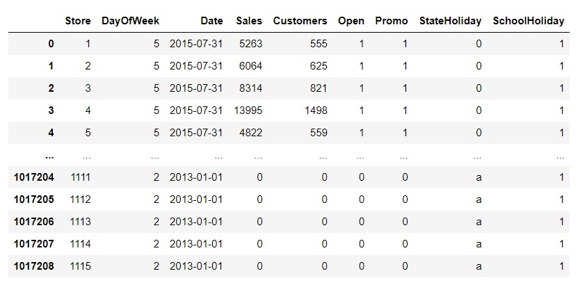
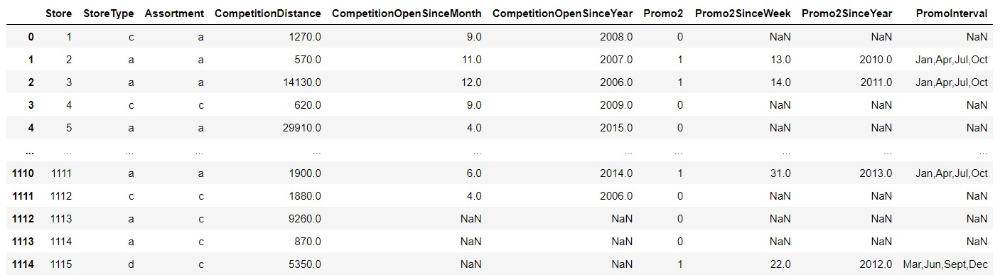
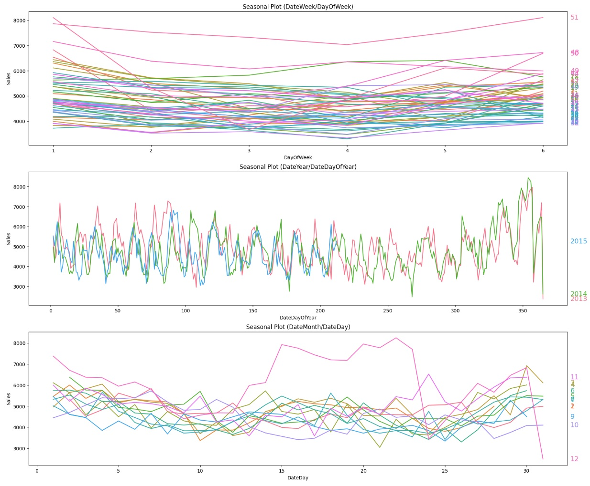
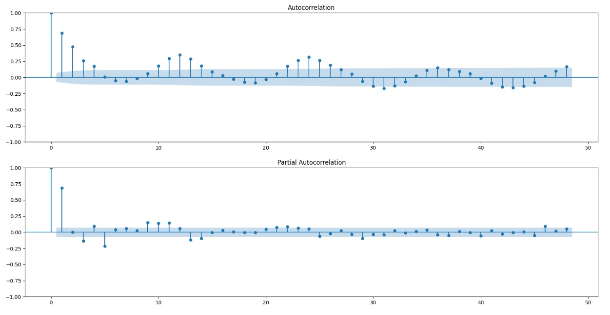
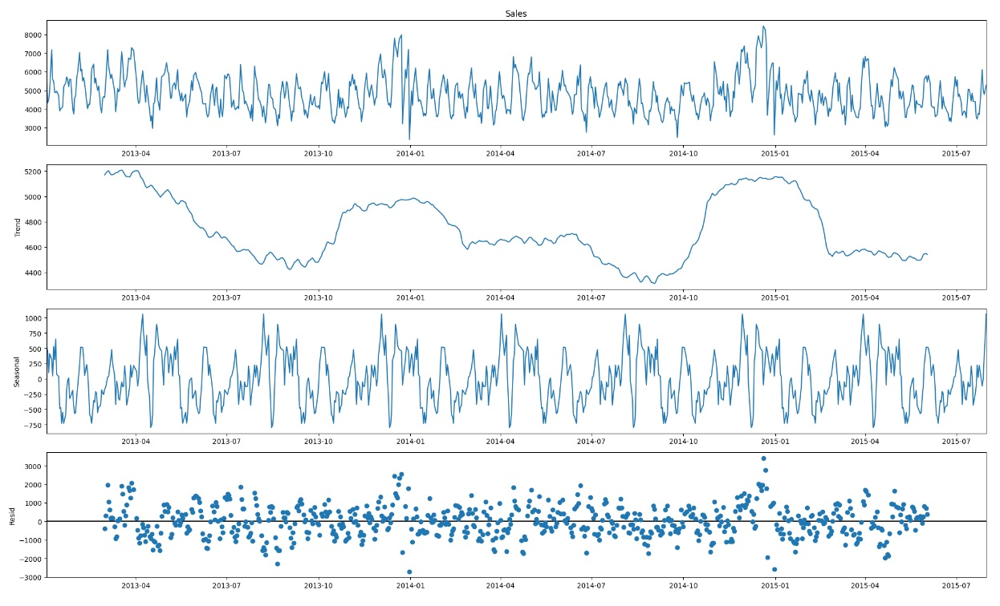
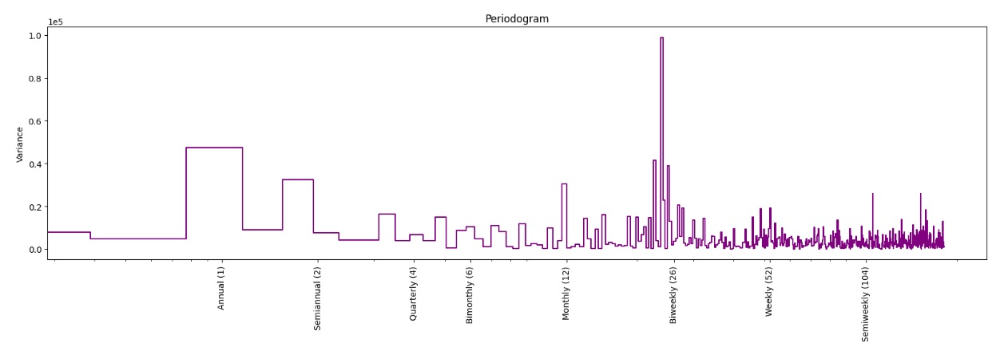
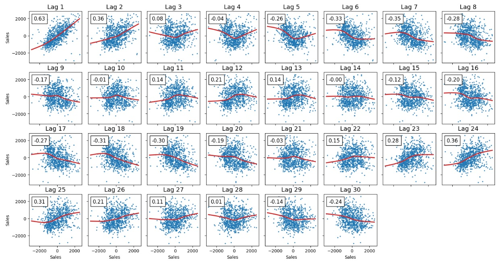

# Rossmann Store Sales

Решение задачи [Rossmann Store Sales](https://www.kaggle.com/c/rossmann-store-sales/data).

Необходимо спрогнозировать ежедневные продажи на срок до шести недель.  
Продажи в магазине зависят от многих факторов, включая рекламные акции, конкуренцию, школьные и государственные праздники, сезонность и местоположение.

## Оглавление

- [Данные](#данные)
- [Предобработка рядов](#предобработка-рядов)
- [Анализ временных рядов](#анализ-временных-рядов)
- [Модели](#модели)  

## Данные

Файлы `train.csv`, `test.csv` и `store.csv` взяты из [Rossmann Store Sales](https://www.kaggle.com/c/rossmann-store-sales/data).

`train.csv`, `test.csv` - информация о продажах (обучающий и тестовый набор) 
`store.csv` - информация о магазинах

`train.csv`, `test.csv`:
- **Id** - идентификатор, представляющий пару (Store, Date) в тестовом наборе.
- **Store** - идентификатор магазина
- **Sales** - продажи в данный день (то, что нужно прогнозировать)
- **Customers** - количество клиентов в данный день 
- **Open** - был ли магазин открыт: 0 = закрыт, 1 = открыт
- **Promo** - действует ли в магазине акция в этот день: 0 = не действует, 1 = действует
- **StateHoliday** - бы ли в данный день государственный праздник.  
  Обычно все магазины, за редким исключением, закрыты в государственные праздники. Обратите внимание, что все школы закрыты в праздничные и выходные дни.  
  a = государственный праздник, b = праздник Пасхи, c = Рождество, 0 = нет
- **SchoolHoliday** - повлияло ли на пару (Store, Date) закрытие государственных школ.

`store.csv`: 
- **StoreType** - модель магазина: a, b, c, d.
- **Assortment** - тип ассортимента: a = базовый, b = дополнительный, c = расширенный
- **CompetitionDistance** - расстояние в метрах до ближайшего магазина конкурента
- **CompetitionOpenSince[Month/Year]** - примерный год и месяц открытия ближайшего конкурента
- **Promo2** - участвует ли магазин в постоянной акции: 0 = не участвует, 1 = участвует
- **Promo2Since[Year/Week]** - год и календарная неделя, когда магазин начал участвовать в Promo2.
- **PromoInterval** - описывает последовательные интервалы запуска Promo2, указывая месяцы, в которые акция начинается заново.  
  Например, «Фев, май, август, ноябрь» означает, что каждый раунд начинается в феврале, мае, августе, ноябре любого данного года 
  для этого магазина.
    

`train.csv`:

`store.csv`:

 

## Предобработка рядов
  - новые признаки, созданные из столбца 'Date' - день, неделя, месяц, год, день года
  - удаление сильно отличающихся частей рядов (в том числе с разрывом)
  - определение у рядов точек-выбросов методом модфицицированного z-score и замена их на предсказания xgboost (метрика - [RMSPE](https://help.pecan.ai/en/articles/6456388-model-performance-metrics-for-regression-models#Modelperformancemetricsforregressionmodels-RootMeanSquaredPercentageError(RMSPE)))
  - заполнение дней, когда магазин закрыт, медианой соседних значений (только для модели линейной регрессии)  

## Анализ временных рядов

Сезонные графики

   
(сезоны - неделя, месяц, год)
  
  
[Сезонный график (Seasonal plot)](https://otexts.com/fpp3/seasonal-plots.html) отображает сегменты временного ряда, каждый из которых соответствует периоду (сезону). 
 

  

Функция автокорреляции (ACF) и функция частичной автокорреляции (PACF)

 

**Автокорреляция** — это корреляция Пирсона между исходным рядом и его версией, сдвинутой на несколько отсчётов. Количество отсчётов, на которое сдвинут ряд, называется лагом автокорреляции.  
**Функция автокорреляции (ACF)** - функция зависимости автокорреляции от величиные лага.  
**Частичная автокорреляция** — это автокорреляция после вычитания авторегрессии предыдущего порядка. 
Например, чтобы подсчитать частичную автокорреляцию с лагом τ = 3, требуется построить авторегрессию порядка 2 (AR(2)), то есть авторегрессию на 2 предыдущих значений ряда, вычесть эту авторегрессию из ряда и подсчитать автокорреляцию с лагом τ = 3 на полученных остатках. И так далее. 
[**Авторегрессию порядка N (AR(N))**](https://ru.wikipedia.org/wiki/Авторегрессионная_модель) - модель линейной регрессии временного ряда, в которой признаки - N предыдущих значений этого же ряда.  
**Функция частичной автокорреляции (PACF)** - функция зависимости частичной автокорреляции от величиные лага. 

Сезонная декомпозиция (STL-декомпозиция) использующая скользящее среднее

 

Сезонная декомпозиция использующая скользящее среднее - это наивное разложение на тренд, сезон и остаток. 
Y[t] = T[t] + S[t] + e[t] 
Y[t] - исходный ряд (1-й график) 
T[t] - тренд (получен скользящим средним с окном заданного размера) (2-й график) 
S[t] - сезон (получен скользящим средним по Y[t] - T[t]) (3-й график) 
e[t] - остаток (Y[t] - T[t] - S[t]) (4-й график) 

Периодограмма

 

[Периодограмма](https://ru.wikipedia.org/wiki/Периодограмма) показывает силу частот во временном ряду.   
Значение графика равно (ax2 + bx2) / 2, где a и b — коэффициенты синуса и косинуса для данной частоты, которые являются амплитудами соответствующих синуса и косинуса.  
Значение периодограммы выражается через аплитуду преобразования Фурье ряда.  
Как правило периодограмма используется для выбора порядка признаков Фурье, которые моделируют сезонность.

Тажке анализируется периодограмма для десезонированного ряда (убраны сезоны за 2 недели и месяц)
  

График запаздывания для 30 лагов для десезонированного ряда (убраны сезоны за 2 недели и месяц)

 

**График запаздывания (lag plot) для лага k** - график где для каждой точки значение по горизонтали - наблюдения ряда, значение по вертикали - предыдущее наблюдение ряда со смещением k.  
  

 

## Модели

### XGBoost

Используется при предобработке рядов для замены выбросов (определенных методом модфицицированного z-score) на предсказания в этих точках. 

Признаки модели:
  - столбцы 'Store', 'Date', 'DayOfWeek', 'Open', 'Promo', 'SchoolHoliday', 'StateHoliday'
  - среднее число продаж за день, среднее число посетителей за день, среднее число продаж на 1 посетителя за день
  - номер дня, недели, месяца, года, дня года
  - столбцы 'StoreType', 'Assortment', 'CompetitionDistance', 'CompetitionOpenInt' (эпохальное время открытия ближайшего конкурента), 'PromoInterval'

### LinearRegression

Используется для прогноза продаж.

Две модели:
- для всех рядов кроме коротких
- для коротких рядов 

Признаки модели:
- константный
- признак тренда 2 порядка
- признак Фурье порядка 6 для годового сезона
- сезонные индикаторы дня недели, дня месяца
- индикатор Нового года, индикатор 22 или 23 числа декабря
- Promo - проходит ли акция в этот день
- лаги: 1, 2, 7, 14, 28, 42
- скользящие статистики: медиана с окном 28, матожидание с окном 28, стандартное отклонение с окном 14, сумма с окном 28

Признаки модели для коротких рядов:
- константный
- сезонные индикаторы дня недели, дня месяца
- индикатор Нового года, индикатор 22 или 23 числа декабря
- Promo - проходит ли акция в этот день

